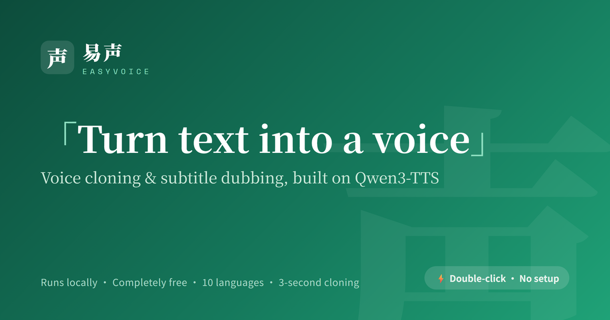

# EasyVoice (易声)

> A local, multilingual, dead-simple dubbing / voice-cloning tool built on Qwen3-TTS.

**English** · [简体中文](README.md)

   

## Overview

**EasyVoice** is a local, **multilingual**, dead-simple dubbing / voice-cloning tool built on [Qwen3-TTS](https://github.com/QwenLM/Qwen3-TTS) (Chinese-first UI, works out of the box):

- **3-second voice cloning** — upload or record ~3 seconds of reference audio to clone a voice for any text / subtitle dubbing.
- **Multilingual** — 10 languages: Chinese, English, Japanese, Korean, German, French, Russian, Portuguese, Spanish, Italian. Auto-detect by default, or pick manually.
- **Remembers your settings** — language / voice / style / speed etc. are saved and restored on next launch.
- **Subtitle dubbing (multi-speaker)** — upload subtitles (SRT / VTT / LRC); voices are auto-assigned per speaker from leading `Name:` prefixes, each line can be previewed / edited / re-rolled, generated timeline-aligned, and muxed straight into your video (dubbed video + aligned subtitles exported). Plain subtitles without prefixes work too (single voice); turn off the _Subtitles have speaker prefixes_ toggle when the text contains colons to avoid mis-splitting. Only have audio/video and no subtitles yet? Run it through [funasr-subtitle](https://github.com/rockbenben/funasr-subtitle) first to get an `.srt`.
- **Runs locally** — fully local inference, nothing uploaded to the cloud.
- **GPU-adaptive** — uses CUDA automatically when a GPU is present, falls back to CPU otherwise.
- **Quality switch (with an NVIDIA GPU)** — manually pick between **Fast 0.6B** and **High 1.7B** models (1.7B auto-downloads on first use); locked to 0.6B without a GPU.
- **Zero-setup** — end users unzip the all-in-one bundle and double-click to launch; developers can run from source.

---

## Download

Grab a bundle from **[Releases](../../releases/latest)** — two options:

> 🇨🇳 **Faster mirror for mainland China**: <https://alist.newzone.top:9003/apps/EasyVoice>

| Bundle                         | Size                      | Best for                | Model                                       |
| ------------------------------ | ------------------------- | ----------------------- | ------------------------------------------- |
| **Full bundle** (GPU/CPU auto) | ~4.6 GB (3 volumes)       | NVIDIA GPU / max speed  | bundled                                     |
| **CPU lite bundle**            | **~0.5 GB (single file)** | no GPU / small download | downloaded in-app on first launch (~1.8 GB) |

- **Full bundle:** download all three volumes (`.zip.01` / `.02` / `.03`) plus `merge-and-extract.bat` into one folder, then double-click the bat to merge & extract.
- **CPU lite bundle:** download the zip with `-cpu` in its name and unzip. ⚠️ **CPU generation is slow**: ~20–40 s per sentence (machine-dependent), minutes for long paragraphs — best for short clips/preview. For GPU speed, use the full bundle.

---

## For end users (3 steps)

### 1. Download & unzip

Pick a bundle from [Download](#download) above and unzip it locally.

### 2. Double-click to launch

Run `Start EasyVoice.bat` in the folder. The first launch takes ~30s (model loading).

> **Note:** Double-click launch requires the bundle (which ships its own `runtime/` and model). Prebuilt bundles are in [Download](#download) above. To run from source, or to build a bundle yourself with `build.ps1` (it lives in the source repo), see **[DEVELOPMENT.en.md](DEVELOPMENT.en.md)**.

### 3. Use it in the browser

A browser opens automatically at `http://127.0.0.1:7860` (if that port is taken the app falls back to another one — trust the address printed in the console window), with four tabs:

- **Dubbing** — type text, pick a language (Auto by default) and reference voice, click generate
- **Subtitle dubbing** — upload subtitles → assign a voice per speaker → fix lines (preview / edit / re-roll) → assemble & export (optionally muxed into your video)
- **My Voices** — upload or record reference voices and manage them (add / delete / rename / reorder / preview)
- **Presets** — save frequently used parameter presets (language + voice) for quick reuse

> **To quit:** close the **console window** that opened at launch (⚠️ closing the browser alone won't quit — the server keeps running in the background, holding memory and the port); or click the **Quit** button at the bottom-right of the page.

---

## Running from source / building a bundle

Dev environment setup, project layout and the packaging script are in **[DEVELOPMENT.en.md](DEVELOPMENT.en.md)**.

---

## Changelog

Per-release notes are on [Releases](../../releases); changes that are in the source but not yet bundled are in [CHANGELOG.en.md](CHANGELOG.en.md).

---

## Credits & License

- This project's own code is licensed under the **MIT License** (see [LICENSE](LICENSE)).
- Built on **[Qwen3-TTS](https://github.com/QwenLM/Qwen3-TTS)** (model weights under Apache License 2.0).
- Licenses and sources of third-party components bundled in the all-in-one package (Qwen3-TTS model / FFmpeg / etc.) are documented in [THIRD-PARTY-NOTICES](assets/packaging/THIRD-PARTY-NOTICES.txt).

---

## Resources

- Qwen3-TTS: https://github.com/QwenLM/Qwen3-TTS
- ModelScope: https://modelscope.cn
- Gradio: https://www.gradio.app

---

## About the 365 Open Source Plan

Project **#018** of the [365 Open Source Plan](https://github.com/rockbenben/365opensource) — one person + AI, 300+ open-source projects in a year. [Submit your idea →](https://365.aishort.top/) · [Discord](https://discord.gg/PZTQfJ4GjX) · [Telegram](https://t.me/aishort_top)
