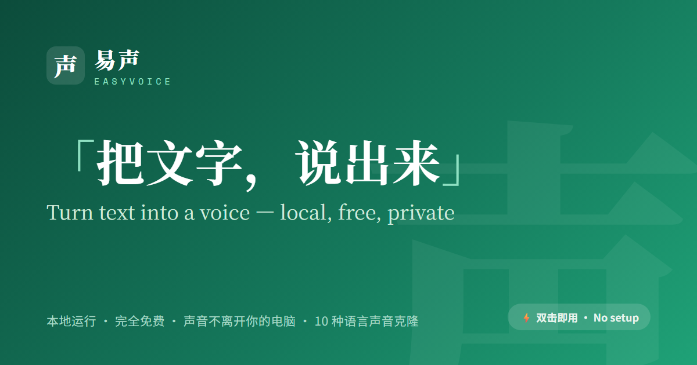

# 易声 (EasyVoice)

> 基于 Qwen3-TTS 的本地多语言傻瓜配音 / 声音克隆工具，中文界面、开箱即用

[English](README.en.md) · **简体中文**

   

## 项目简介

**易声(EasyVoice)** 是一个基于 [Qwen3-TTS](https://github.com/QwenLM/Qwen3-TTS) 的本地**多语言**傻瓜配音 / 声音克隆工具（中文界面，开箱即用），特点如下：

- **3 秒声音克隆**：上传或录制约 3 秒参考音频，即可克隆出该音色，用于任意文本 / 字幕配音
- **多语言配音**：支持中文、英文、日文、韩文、德文、法文、俄文、葡萄牙文、西班牙文、意大利文共 **10 种语言**，默认「自动识别语种」，也可手动指定
- **省心**：配音参数（语言 / 音色 / 风格 / 语速等）自动记忆，下次打开沿用
- **字幕配音（多角色）**：上传字幕（SRT / VTT / LRC），按行首「名字：」前缀自动分配说话人音色、逐条试听 / 改词 / 重录，按时间轴对齐生成，并可直接合进原视频（导出成片 + 对齐字幕）。无说话人前缀的普通字幕同样支持（单一音色）；正文含冒号时可关闭「字幕含说话人前缀」开关避免误拆。手头只有音视频、还没有字幕？用 [funasr-subtitle](https://github.com/rockbenben/funasr-subtitle) 先转出 `.srt`
- **本地运行**：全程本地推理，不上传云端，保护隐私
- **显卡自适应**：有 GPU 自动使用 CUDA 加速，无显卡自动降级到 CPU
- **音质可选（有 N 卡时）**：在「极速 0.6B / 高质 1.7B」两档模型间手动切换（首次用 1.7B 自动下载）；无显卡固定 0.6B
- **开箱即用**：普通用户下载整合包解压双击启动，开发者可本地源码运行

---

## 下载

前往 **[Releases](../../releases/latest)** 下载，两种整合包任选：

> 🇨🇳 **国内下载（更快）**：<https://alist.newzone.top:9003/apps/EasyVoice>

| 包                             | 体积                 | 适用               | 模型                       |
| ------------------------------ | -------------------- | ------------------ | -------------------------- |
| **完整大包**（GPU/CPU 自适应） | ~4.6GB（分 3 卷）    | 有 N 卡 / 追求速度 | 内置                       |
| **CPU 精简包**                 | **~0.5GB（单文件）** | 无显卡 / 想要小包  | 首启在工具内下载（~1.8GB） |

- **完整大包**：把 3 个分卷（`.zip.01` / `.02` / `.03`）和 `merge-and-extract.bat` 下到同一文件夹，双击 bat 自动合并解压。
- **CPU 精简包**：下载文件名带 `-cpu` 的那个 zip，解压即用。⚠️ **CPU 生成较慢**：约每句 20–40 秒（视机器）、长段落数分钟，适合短句/预览。有 N 卡求速度请用完整大包。

---

## 普通用户使用（3 步）

### 第 1 步：下载并解压

按上方 [下载](#下载) 选一种整合包，解压到本地目录。

### 第 2 步：双击启动

在目录里双击 `Start EasyVoice.bat`，首次启动约需 30 秒（加载模型）。

> **注意**：双击启动需要整合包（自带 `runtime/` 运行时与模型），预编译整合包见上方[下载](#下载)。想自己打包可用项目内的 `build.ps1`。只跑源码见下方**开发者运行**。

### 第 3 步：浏览器中使用

启动后自动打开浏览器 `http://127.0.0.1:7860`，共四个标签页：

- **配音**：输入文本，选择语言（默认自动）与参考音色，点击生成
- **字幕配音**：上传字幕 → 按说话人分配音色 → 逐条挑错（试听 / 改词 / 重录）→ 合成导出（可合进原视频）
- **我的音色库**：上传或录制参考音色并管理（添加、删除、重命名、调序、试听）
- **常用方案**：保存常用的配音参数预设（语言 + 音色），快速调用

> **退出**：用完后**关闭启动时弹出的命令行窗口**即可退出（⚠️ 仅关浏览器不会退出，服务仍在后台占用内存与端口）；也可点界面右下角的「退出」按钮。

---

## 自己跑源码 / 自行打包

开发环境搭建、项目结构、整合包打包脚本见 **[DEVELOPMENT.md](DEVELOPMENT.md)**。

---

## 更新记录

各版本改动见 [Releases](../../releases)；已在源码、尚未打进整合包的改动见 [CHANGELOG.md](CHANGELOG.md)。

---

## 致谢与许可

- 本项目自身代码采用 **MIT License**（见 [LICENSE](LICENSE)）。
- 基于 **[Qwen3-TTS](https://github.com/QwenLM/Qwen3-TTS)**（模型权重 Apache License 2.0）。
- 整合包内含的第三方组件（Qwen3-TTS 模型 / FFmpeg 等）的许可与来源见 [THIRD-PARTY-NOTICES](assets/packaging/THIRD-PARTY-NOTICES.txt)。

---

## 更多资源

- Qwen3-TTS：https://github.com/QwenLM/Qwen3-TTS
- ModelScope：https://modelscope.cn
- Gradio：https://www.gradio.app

---

## 关于 365 开源计划

[365 开源计划](https://github.com/rockbenben/365opensource) 的第 **#018** 个项目——一个人 + AI，一年 300+ 个开源项目。[提交你的需求 →](https://365.aishort.top/) · [Discord](https://discord.gg/PZTQfJ4GjX) · [Telegram](https://t.me/aishort_top)
